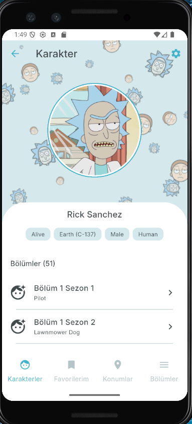
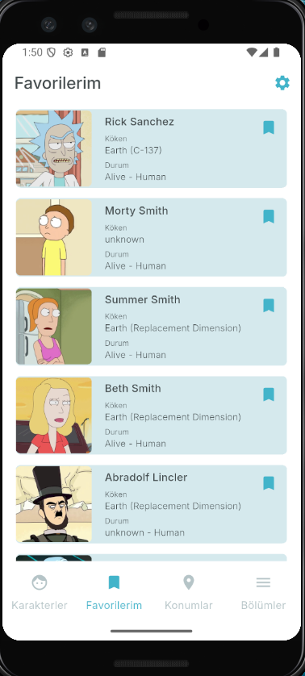
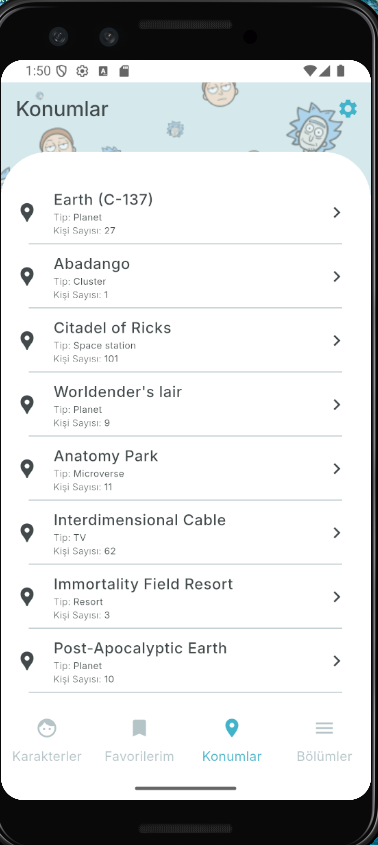
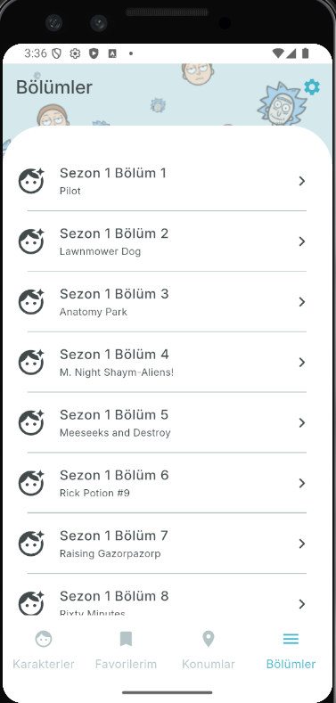
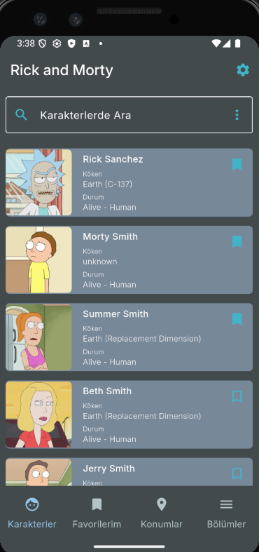

# 🚀 Rick and Morty Flutter App

Bu proje, Rick and Morty evrenindeki karakterleri, bölümleri ve diğer detayları keşfetmek için geliştirilmiş bir Flutter uygulamasıdır.

---

## ✨ Özellikler

- ✅ Karakterlerin resim, isim, köken ve durum bilgilerinin gösterimi
- ⏫ Bölümler ve bölümlere ait karakterleri görüntüleme
- 🌍 Konumlar ve o konumlarda bulunan karakterler
- 🧱 Temiz ve modern kart tasarımı
- ⭐️ Stack widget ile aksiyon butonları (örnek: favorilere ekleme)
- 🌐 Gerçek zamanlı veri çekimi (Rick and Morty API)
- 📄 Sayfalama ile akıcı listeleme
- ❤️ Favorilere ekleme ve kaldırma
- 🔍 Gerçek zamanlı karakter arama ve statüye göre filtreleme
- 🔨 Ayarlar sayfası ve karanlık mod

---

## 🛠️ Kullanılan Teknolojiler

- 💙 Flutter (Dart)
- 🎨 Provider (State Management)
- 🌐 REST API

---

## API

Bu proje, [Rick and Morty API](https://rickandmortyapi.com/) kullanılarak geliştirilmiştir. API, karakterler, bölümler ve mekanlar hakkında bilgi sağlar.

## 🧩 Kurulum

Aşağıdaki adımları takip ederek projeyi çalıştırabilirsiniz:

```bash
git clone https://github.com/haktanbasak/Flutter_RickAndMorty.git
cd Flutter_RickAndMorty
flutter pub get
flutter run
```

<h2 align="center">📱 Uygulama Görselleri</h2>

<p align="center">
  
  
  
  
  
  
</p>
